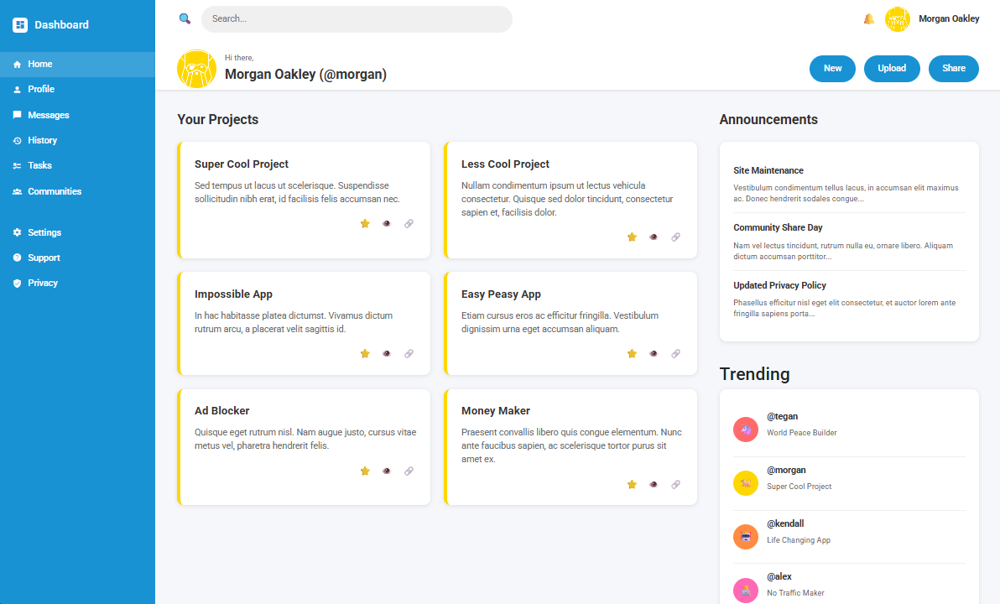

# Admin Dashboard Project - The Odin Project

## �️ Preview



*A modern, responsive admin dashboard built with CSS Grid and featuring a clean, professional interface.*

## �📚 Learning Context

This project is part of **The Odin Project's** curriculum for **Intermediate HTML and CSS**:
**[Admin Dashboard Lesson](https://www.theodinproject.com/lessons/node-path-intermediate-html-and-css-admin-dashboard)**

### 🎯 Project Goals (From The Odin Project)
- Practice **CSS Grid** for complex layouts
- Build a **responsive admin dashboard** interface
- Implement **modern CSS** techniques and best practices
- Create a **professional-looking** web application UI

### ✅ Requirements Met
- ✅ **CSS Grid Layout** - Main dashboard uses CSS Grid
- ✅ **Responsive Design** - Works on different screen sizes
- ✅ **Professional UI** - Clean, modern dashboard interface
- ✅ **Interactive Elements** - Hover effects, active states
- ✅ **Proper HTML Structure** - Semantic HTML markup

## 📁 Project Structure
```
Admin Dashboard/
├── index.html          # Main HTML file
├── css/
│   ├── sidebar-and-base.css # Base styles, reset, and sidebar
│   ├── header.css          # Header component styles
│   └── main-content.css    # Main content and cards styles
├── js/
│   ├── utils.js            # Utility classes and helpers
│   ├── navigation.js       # Navigation component
│   ├── search.js           # Search functionality
│   ├── project-cards.js    # Project cards component
│   ├── button-actions.js   # Button actions component
│   └── dashboard.js        # Main dashboard controller
└── images/
    └── odin-lined.png      # User avatar image
```

## 🚀 Features & Technologies

### 🎨 CSS Techniques (Odin Project Focus)
- **CSS Grid** - Main layout structure with grid-template-areas
- **Flexbox** - Component alignment and flexible layouts
- **CSS Custom Properties** - Consistent color scheme
- **Responsive Design** - Mobile-first approach
- **Modern Styling** - Box shadows, border radius, transitions

### CSS Architecture
- **Modular CSS**: Separated into logical components
- **sidebar-and-base.css**: Base styles, CSS reset, grid layout, sidebar, and navigation
- **header.css**: Header section with search and user info
- **main-content.css**: Projects grid, cards, and right sidebar

### JavaScript Architecture (Enhanced Beyond Requirements)
- **Modular Components**: Each feature is a separate class/module
- **utils.js**: Base classes (EventHandler, DOMUtils, Animator)
- **navigation.js**: Navigation component with active state management
- **search.js**: Search functionality with debouncing
- **project-cards.js**: Project cards with hover effects and filtering
- **button-actions.js**: Button actions with extensible action system
- **dashboard.js**: Main controller that orchestrates all components

### 🛠️ External Libraries
- **Bootstrap 5** - For additional utility classes and icons
- **Material Design Icons** - Professional iconography
- **Google Fonts (Roboto)** - Modern typography

### HTML Structure
- **Semantic HTML**: Clean, accessible markup
- **External Dependencies**: CDN links for Bootstrap and icons
- **Modular Imports**: Separated CSS and JS files

## 🔧 How to Use

1. **Open the new file**: Use `index-new.html` as your main file
2. **File Organization**: All styles are in the `css/` folder
3. **JavaScript**: Enhanced functionality in `js/dashboard.js`
4. **Easy Maintenance**: Each component is in its own file

## 🎨 Benefits

### 🏆 Odin Project Skills Demonstrated
- **CSS Grid Mastery** - Complex layout with grid-template-areas
- **Responsive Web Design** - Mobile-friendly interface
- **Modern CSS** - Clean, professional styling
- **HTML Semantics** - Proper document structure
- **User Experience** - Intuitive navigation and interactions

### 💡 Additional Enhancements
- **Better Organization**: Easy to find and edit specific styles
- **Maintainability**: Changes to one component won't affect others
- **Scalability**: Easy to add new features and components
- **Performance**: Optimized CSS and JavaScript loading
- **Team Collaboration**: Multiple developers can work on different files
- **Modern JavaScript**: ES6+ features and modular architecture

## � Related Odin Project Lessons

- **[CSS Grid](https://www.theodinproject.com/lessons/node-path-intermediate-html-and-css-grid)** - Layout technique used
- **[Flexbox](https://www.theodinproject.com/lessons/node-path-intermediate-html-and-css-flexbox)** - Component alignment
- **[Responsive Design](https://www.theodinproject.com/lessons/node-path-intermediate-html-and-css-responsive-design)** - Mobile-first approach

## 📝 Getting Started

1. **Open the main file**: Use `index-new.html` as your primary file
2. **View in browser**: Open with any modern web browser
3. **Explore the code**: Each component is organized in separate files
4. **Modify and experiment**: Try changing colors, layouts, or adding features


